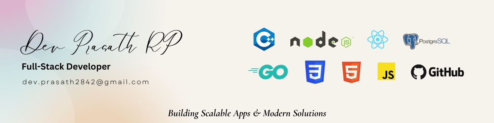

# 💻 Dev Prasath RP – Portfolio

## Hi, I’m Dev 👋
I’m a **passionate Full-Stack Developer** specializing in **React, Node.js, GoLang, and PostgreSQL**. I build **scalable, high-performance web applications** with clean code and thoughtful architecture.

---

## 🛠️ Tech Stack
| Frontend | Backend | Database | Tools |
|----------|--------|---------|-------|
| React.js, Tailwind CSS, HTML, CSS, JavaScript | Node.js, Express.js, GoLang | PostgreSQL, MS SQL | Git, GitHub, Vite, Postman, VSCode |

---

## 🚀 Projects

### 1. **BookNGo – Event Booking Platform**
- Users can browse events, book tickets, and view booking history.  
- Admins can create events and manage all bookings.  
- **Tech:** React, Node.js, PostgreSQL, Tailwind CSS  
- **Repo:** ([Frontend](https://github.com/PrAsAnTh28402/BookNGo_Frontend)) | ([Backend](https://github.com/PrAsAnTh28402/BookNGo_Backend))

### 2. **Portfolio Website**
- Personal portfolio to showcase projects and skills.  
- **Tech:** React, Tailwind CSS, Vite  

---

## 🌟 Key Highlights
- 10+ months of professional experience in **full-stack development**  
- Strong understanding of **REST APIs, database management, and UI/UX principles**  
- Designed and implemented **scalable architectures** and **high-performance applications**  
- Enthusiastic about learning **new technologies and building real-world projects**  

---

## 📂 Portfolio Sections
- **Hero:** Landing page with intro and CTA  
- **About Me:** Summary of skills and experience  
- **Skills:** Technical stack overview with icons  
- **Projects:** Screenshots and descriptions of major projects  
- **Contact:** Email, LinkedIn, GitHub  

---

## 📫 Contact Me
- **Email:** dev.prasath2842@gmail.com  
- **LinkedIn:** ([linkedin.com/in/devprasath](https://www.linkedin.com/in/dev-prasath-rp/))  

---

## ⚡ Fun Fact
> “I love building things that people actually use. Code is my playground, and problem-solving is my superpower!”  

---

Made with ❤️ using **React, Tailwind CSS, and Vite**
